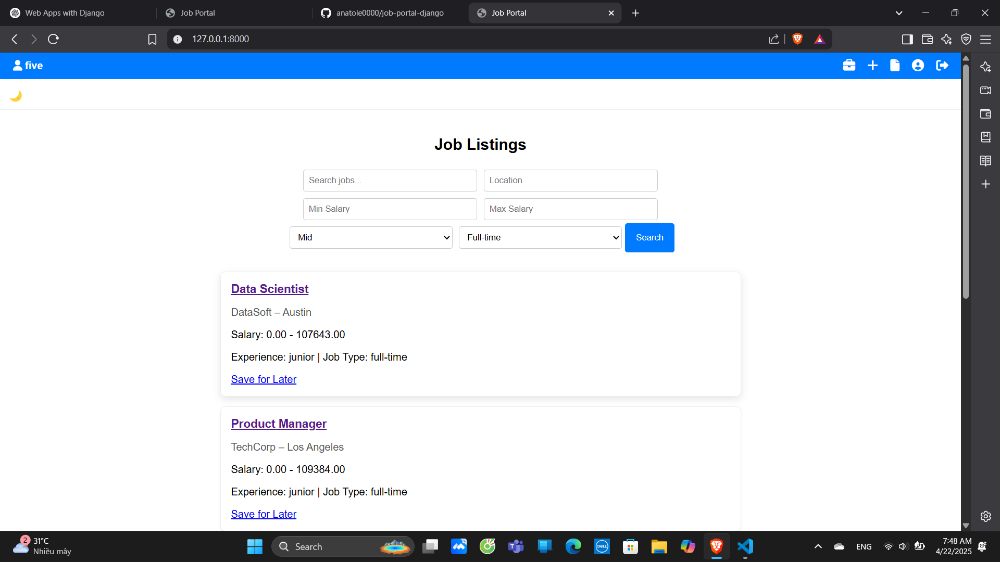

# Job Portal

A web application for job seekers and employers. The platform allows users to create job listings, apply for jobs, and track application statuses.

## Features

- 🔍 Job listing and filtering
- 👤 User authentication (login/register)
- 📄 Apply for jobs
- 💾 Save jobs
- 🎯 **Job Matching** - users get matched with relevant jobs based on profile
- 🤖 **Job Recommendations** - AI-based or logic-based recommendations for jobs

## Technologies Used

- **Django** (Backend)
- **SQLite** (Database)
- **HTML/CSS** (Frontend)
- **Git** (Version Control)

## Setup Instructions

### Prerequisites

- Python 3.x
- Django 5.x

### Steps to Run Locally

1. Clone the repository:
   ```bash
   git clone https://github.com/anatole0000/job-portal.git

## License

This project is licensed under the MIT License - see the [LICENSE](LICENSE) file for details.

## 🛠️ Generate Fake Job Listings

To populate the database with sample job postings, run the `popular_fake_jobs.py` script:

```bash
python popular_fake_jobs.py


## Screenshot

